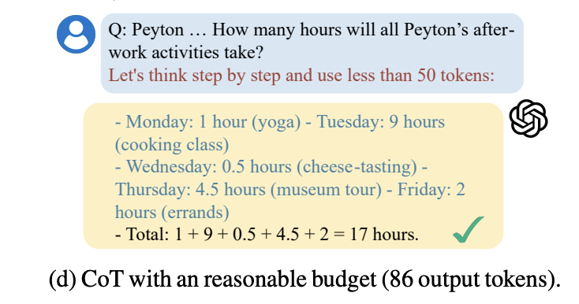

# Token-Budget-Aware LLM Reasoning for Multimodal Environments (VLM Implementation)

This project extends the work presented in the paper [Token-Budget-Aware LLM Reasoning](https://huggingface.co/papers/2412.18547) by implementing a token-budget-aware reasoning method for **multimodal environments (VLM)**. While the paper focuses on Chain-of-Thought (CoT) reasoning for LLMs, it does not address multimodal inputs, such as text and images. This implementation bridges that gap.

---

  

    <h3 style="margin-top: 0;">Chain-of-Thought Reasoning with Budget</h3>
    

      This illustration demonstrates how chain-of-thought (CoT) reasoning can be guided by a limited token budget, ensuring efficiency without sacrificing too much performance. By allocating tokens more wisely, we reduce overhead and cost.
    

  

  

    
  

---

  

    <h3 style="margin-top: 0;">Budget Estimator</h3>
    

      The budget estimator, inspired by the paper, dynamically predicts the number of tokens required for reasoning based on textual or multimodal input complexity. This helps maintain a balance between efficiency and accuracy.
    

  

  

    
  

---

## Key Features

- **Multimodal Token Budget Prediction**: Fine-tuned an LLM with LoRA, paired with a frozen SigLIP image encoder.  
- **Custom Prediction Head**: A specialized head combining the SigLIP CLS token and LLM hidden states to dynamically predict token budgets.  
- **Evaluation**: Compared text-only vs. multimodal (text + image) inputs, demonstrating the effectiveness of token budgeting.

## Methodology

1. **Fine-tuned LLM**  
   Used LoRA to fine-tune the LLM for token-budget-aware reasoning tasks.
2. **Frozen SigLIP Encoder**  
   Leveraged SigLIP to encode visual inputs, extracting the CLS token for multimodal processing.
3. **Custom Prediction Head**  
   Combined the CLS token from SigLIP and the hidden states of the LLM to predict token budgets.
4. **Evaluation**  
   Compared reasoning efficiency and accuracy using text-only prompts versus multimodal prompts.

## Results

For an in-depth look at the results, see our [Weights & Biases report](https://api.wandb.ai/links/amit154154/9sa4u3th).

---